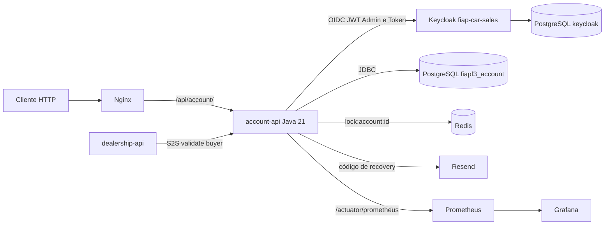
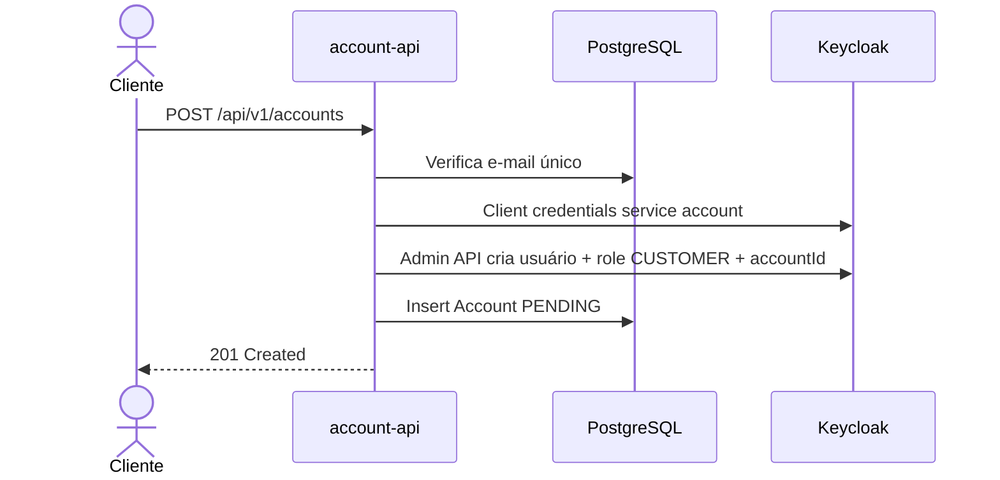
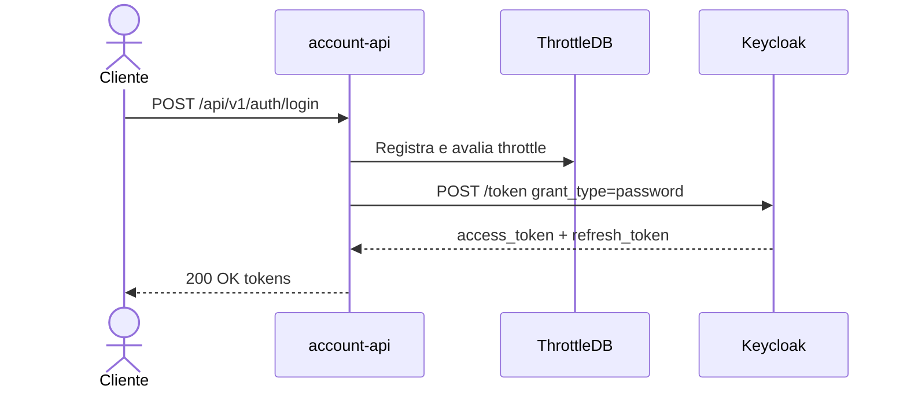
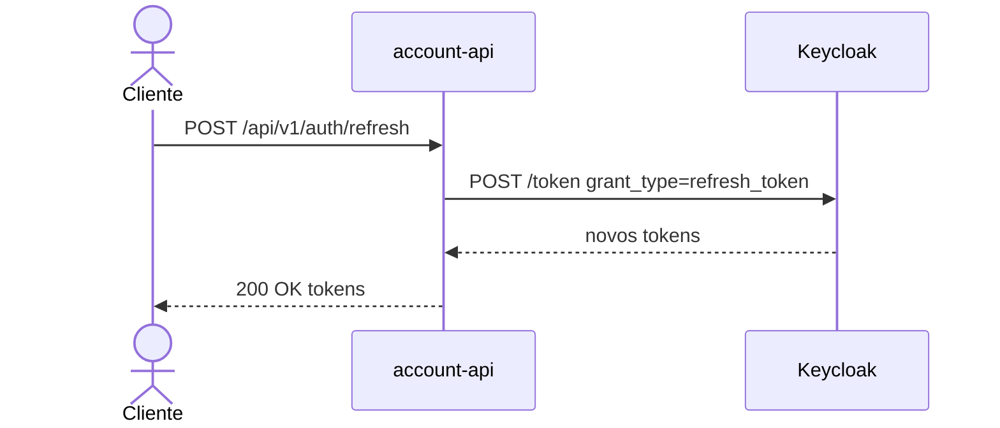
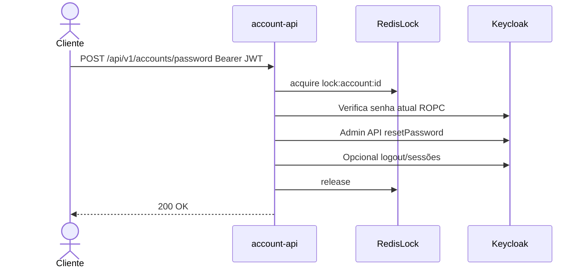
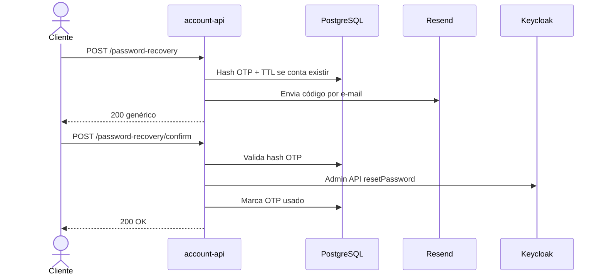
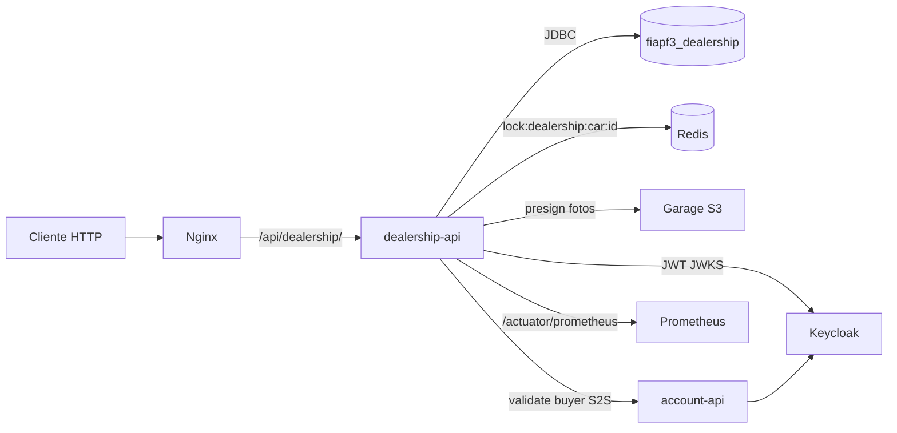

# Arquitetura proposta — FIAP Car Sales (account-api + dealership-api)

O código está em dois repositórios. **`fiap-fase-4-system`** (este, quando lido a partir da account) guarda a `account-api`, o Nginx e a infra compartilhada, inclusive o Postgres de `fiapf3_account` e `keycloak`. **`fiap-fase-4-dealership`** guarda a `dealership-api` e o Postgres de `fiapf3_dealership`. Os dois Composes usam a rede `fiapf3-dev-net` / `fiapf3-prod-net`. O acesso externo não muda: `http://localhost/api/account/...` e `http://localhost/api/dealership/...` no Nginx da account. A lógica das APIs, os paths e os hostnames `account`, `dealership`, `redis`, `garage` e `keycloak` permanecem.

## 1. Objetivo

Este documento descreve a arquitetura proposta e o planejamento detalhado de implementação dos backends da plataforma de revenda de veículos (FIAP Fase 4):

- **Parte I — `account-api`:** ciclo de vida de conta e autenticação.
- **Parte II — `dealership-api`:** catálogo, veículos, listagem, compra e fotos.

### Parte I — Escopo account-api

- criar conta;
- alterar senha;
- recuperar senha (código por e-mail);
- autenticar (login);
- renovar tokens (refresh token);
- completar perfil (`PENDING → VALIDATED`);
- validate buyer S2S para a `dealership-api`.

A solução utiliza:

- **API:** Java 21 e Spring Boot 4, em [`backends/account-api`](../backends/account-api).
- **Identidade:** Keycloak (realm `fiap-car-sales`), client confidencial `account-api` (OIDC / JWT).
- **Persistência:** PostgreSQL, banco lógico `fiapf3_account`.
- **Locks distribuídos:** Redis, chave `lock:account:{id}` (não é cache de sessão).
- **Notificações:** Resend (código de recuperação de senha).
- **Entrada HTTP:** Nginx como reverse proxy (`/api/account/` → `account:8080/api/`).
- **Observabilidade:** Actuator + Micrometer, Prometheus e Grafana.
- **Estilo de design:** arquitetura hexagonal, Domain-Driven Design (DDD) e Object Calisthenics.

Referências:

- [Especificação do desafio](./0-fiap-fase-4.md)
- [Documento de arquitetura final](./2-documento-de-arquitetura-final.png)
- [Rascunho de arquitetura inicial](./1-rascunho-de-arquitetura-inicial.png)
- Realm Keycloak: [`infra/confs/keycloak/import/fiap-car-sales-realm.json`](../infra/confs/keycloak/import/fiap-car-sales-realm.json)

## 2. Resumo da solução

A arquitetura separa identidade e ciclo de vida de conta dos dados transacionais de veículos e vendas:

1. O cliente (frontend futuro ou ferramenta HTTP) chama a API pública via Nginx em `/api/account/v1/...`.
2. O Nginx remove o prefixo `/account` e encaminha para `account:8080/api/v1/...`.
3. A **`account-api`** orquestra os casos de uso em arquitetura hexagonal: valida entrada, aplica regras de domínio, persiste o perfil local e integra com Keycloak, Resend e Redis.
4. **Senhas e tokens** são responsabilidade do Keycloak. A API não armazena senha nem emite JWT próprio.
5. No cadastro, a API cria o usuário no Keycloak (Admin API), atribui a role `CUSTOMER`, grava o atributo `accountId` e persiste o agregado `Account` em `fiapf3_account` com status `PENDING`.
6. No login e no refresh, a API usa o token endpoint do Keycloak (client confidencial `account-api` com Direct Access Grants) e devolve access/refresh tokens ao cliente.
7. Na alteração de senha, a API exige JWT válido, verifica a senha atual e atualiza a credencial via Admin API do Keycloak.
8. Na recuperação, a API gera um código OTP de uso único, persiste apenas o hash em PostgreSQL, envia o valor em claro por e-mail (Resend) e, na confirmação, redefine a senha no Keycloak.
9. A **`dealership-api`** chama a `account-api` via HTTP (`ACCOUNT_API_URL`) com client-credentials do Keycloak para validar comprador antes da compra (`GET /api/v1/internal/accounts/{id}/buyer-validation`). A `account-api` **nunca** chama a `dealership-api` e **nunca** acessa `fiapf3_dealership`.

Essa separação atende ao requisito de manter cadastro e autorização de compradores apartados dos dados de vendas.

## 3. Estilo arquitetural e princípios de design

A `account-api` é organizada com as seguintes práticas:

### Arquitetura hexagonal (Ports and Adapters)

O domínio fica no centro. Entradas e saídas (HTTP, Keycloak, PostgreSQL, Redis, Resend) são adaptadores conectados por portas. Isso isola regras de negócio de frameworks e facilita testes.

### Domain-Driven Design (DDD)

O contexto delimitado é **Account / Identity lifecycle**. O agregado principal é `Account` (identidade local, status `PENDING`|`VALIDATED`, vínculo com o usuário Keycloak). Credenciais e sessões OIDC permanecem no Keycloak; a API é dona do perfil de negócio e dos artefatos de recovery/throttle.

### Object Calisthenics

O código de domínio e aplicação segue Object Calisthenics: um nível de indentação por método, evitar `else` quando possível, encapsular primitivos com significado de negócio, coleções de primeira classe, um ponto por linha, sem abreviações e entidades pequenas sem getters/setters que vazem estado mutável sem necessidade.

### Padrões de integração e consistência

- **Integração síncrona HTTP** com Keycloak (Admin API + Token endpoint) e Resend;
- **Retry de infraestrutura** nos adapters Keycloak, JDBC e Resend;
- **Idempotência de negócio** no cadastro (e-mail único local e no Keycloak);
- **Throttle persistido** em login, refresh e recovery;
- **Distributed lock (Redis)** por `accountId` em operações sensíveis de conta;
- **Anti-enumeration** nas respostas de recuperação de senha.

Não há mensageria (RabbitMQ) neste serviço: o desenho da plataforma para conta/identidade é síncrono.

## 4. Visão de componentes



## 5. Responsabilidades

### 5.1. account-api

Porta de entrada do contexto de conta e autenticação. Responsabilidades deste planejamento:

- criar conta de comprador (`CUSTOMER`);
- autenticar (login) e renovar tokens (refresh);
- alterar senha do usuário autenticado;
- iniciar e confirmar recuperação de senha via código por e-mail;
- persistir perfil local (`Account`) e artefatos de recovery/throttle;
- validar JWT emitido pelo Keycloak em rotas protegidas (OAuth2 Resource Server);
- expor métricas Actuator para Prometheus;
- **não** acessar `fiapf3_dealership` e **não** chamar `dealership-api`.

Bibliotecas e módulos previstos:

- Spring Web / Security (OAuth2 Resource Server JWT);
- Spring Data JPA + Flyway;
- Spring Data Redis (locks);
- Spring Validation;
- Spring Boot Actuator + Micrometer (Prometheus);
- Spring Retry (ou equivalente) em adapters de infraestrutura;
- cliente HTTP (RestClient / WebClient) para Keycloak Admin e Token endpoints;
- cliente HTTP para Resend.

### 5.2. Keycloak

Provedor central de identidade e autorização:

- realm `fiap-car-sales`;
- roles de realm `ADMIN` e `CUSTOMER`;
- client confidencial `account-api`: Direct Access Grants + service account com `manage-users`, `view-users`, `query-users`, `view-realm`;
- mappers de audience (`account-api`, `dealership-api`) e claim `accountId` a partir do atributo de usuário;
- armazenamento interno em banco `keycloak` (não acessado diretamente pela API).

### 5.3. PostgreSQL (`fiapf3_account`)

Banco exclusivo da `account-api`: contas locais, tokens de recuperação (hash) e throttles. Não armazena senha em claro nem hash de senha de login (isso fica no Keycloak).

### 5.4. Redis

Usado **somente** como lock distribuído:

- chave: `lock:account:{accountId}`;
- acquire bloqueante com lease curto;
- release seguro (token de aquisição);
- **não** armazena sessões, refresh tokens nem cache de negócio.

### 5.5. Resend

Envio do código OTP de recuperação de senha. Falha de e-mail deve ser registrada; a API responde de forma genérica no request de recovery (anti-enumeration) e não deve vazar existência de conta.

### 5.6. Nginx

- `/api/account/` → `http://account:8080/api/` (URL pública `/api/account/v1/...`);
- host `keycloak.*` → console/admin do Keycloak;
- scrape de métricas permanece em `account:8080/actuator/prometheus` na rede interna.

## 6. Fluxos principais

### 6.1. Criar conta

1. Cliente envia `POST /api/v1/accounts` com e-mail, senha e dados mínimos de perfil.
2. O web adapter valida o contrato (Jakarta Validation) e chama o primary port.
3. A aplicação verifica unicidade local do e-mail; conflito → `409`.
4. Obtém token de service account no Keycloak e cria o usuário via Admin API (`enabled`, e-mail verificado conforme política, credencial não temporária).
5. Atribui role de realm `CUSTOMER` e define o atributo de usuário `accountId` com o identificador da conta local.
6. Persiste `Account` em `fiapf3_account` com status `PENDING` e o `keycloakUserId`.
7. Em falha após criar no Keycloak, a aplicação compensa ou marca inconsistência (retry/compensação no adapter — não deixar usuário órfão sem registro local quando possível).
8. Resposta `201 Created` com identificador da conta (sem senha).



### 6.2. Autenticar (login)

1. Cliente envia `POST /api/v1/auth/login` com e-mail (username) e senha.
2. A API aplica throttle por sujeito/operação.
3. A API chama o token endpoint do Keycloak com `grant_type=password`, `client_id`, `client_secret`, `username` e `password` (ROPC no client confidencial).
4. Em sucesso, devolve access token, refresh token, `expires_in` e `token_type`.
5. Em credenciais inválidas, responde `401` sem detalhar causa interna do IdP.
6. A API **não** persiste refresh token localmente; a sessão fica no Keycloak.



### 6.3. Refresh token

1. Cliente envia `POST /api/v1/auth/refresh` com o refresh token.
2. A API aplica throttle.
3. A API chama o token endpoint com `grant_type=refresh_token`, `client_id`, `client_secret` e `refresh_token`.
4. Em sucesso, devolve o novo par de tokens (conforme política do realm).
5. Refresh inválido/expirado → `401`.



### 6.4. Alterar senha

1. Cliente autenticado envia `POST /api/v1/accounts/password` com senha atual e nova senha, Authorization Bearer.
2. O Resource Server valida o JWT (issuer/JWKS Keycloak) e extrai `accountId` / subject.
3. A API adquire lock Redis `lock:account:{id}`.
4. Verifica a senha atual via tentativa controlada no token endpoint (ROPC) ou fluxo equivalente sem vazar detalhe.
5. Atualiza a credencial no Keycloak via Admin API (`resetPassword`, não temporária).
6. Opcionalmente invalida sessões ativas do usuário no Keycloak após a troca.
7. Libera o lock e responde `200 OK` (sem corpo sensível).



### 6.5. Recuperar senha

#### Request

1. Cliente envia `POST /api/v1/accounts/password-recovery` com e-mail.
2. A API aplica throttle e sempre responde `200` genérico (não revela se o e-mail existe).
3. Se a conta existir: gera código OTP (TTL curto, default `PT15M`), persiste **somente o hash**, invalida códigos anteriores ativos.
4. Envia o código em claro por e-mail via Resend (template simples; `PASSWORD_RECOVERY_URL` pode orientar o frontend).
5. Falha de envio: log em inglês + métrica; não confirma existência da conta na resposta HTTP.

#### Confirm

1. Cliente envia `POST /api/v1/accounts/password-recovery/confirm` com e-mail, código e nova senha.
2. A API valida código (hash, TTL, não usado), adquire lock da conta.
3. Redefine a senha no Keycloak via Admin API.
4. Marca o token como usado, invalida demais códigos ativos e, se aplicável, sessões Keycloak.
5. Sucesso → `200`; código inválido/expirado → `400` (ou `401` conforme política única documentada no handler).



## 7. Contratos HTTP

Base interna da API: `/api/v1/...`.  
Base pública (Nginx): `/api/account/v1/...`.

Erros: RFC 7807 `ProblemDetail` via `@ControllerAdvice`. Convenções de status do projeto:

| Situação | Status |
|---|---|
| Criação | `201 Created` |
| Leitura/atualização OK | `200 OK` |
| Not found (convenção do projeto) | `204 No Content` |
| Request inválido | `400` |
| Não autenticado | `401` |
| Proibido | `403` |
| Conflito (ex.: e-mail) | `409` |
| Erro inesperado | `500` |

### 7.1. Controllers

Dois controllers em `adapters/drivers/webapis/controllers`:

| Controller | Responsabilidade |
|---|---|
| `AccountController` | Conta e senha: create, change password, recovery request/confirm |
| `AuthController` | Login e refresh token |

### 7.2. Endpoints

| Controller | Método | Rota | Auth |
|---|---|---|---|
| Account | `POST` | `/api/v1/accounts` | Público (admin JWT opcional para criar `ADMIN`) |
| Account | `GET` | `/api/v1/accounts/me` | Bearer JWT (usuário com `accountId`) |
| Account | `POST` | `/api/v1/accounts/me/profile` | Bearer JWT (usuário com `accountId`) |
| Account | `POST` | `/api/v1/accounts/password` | Bearer JWT |
| Account | `POST` | `/api/v1/accounts/password-recovery` | Público |
| Account | `POST` | `/api/v1/accounts/password-recovery/confirm` | Público |
| Account | `GET` | `/api/v1/internal/accounts/{accountId}/buyer-validation` | Bearer JWT service account (`azp` em `account.s2s.allowed-client-ids`) |
| Auth | `POST` | `/api/v1/auth/login` | Público |
| Auth | `POST` | `/api/v1/auth/refresh` | Público |

Not-found / delete sem corpo → **204** (convenção do projeto).

### 7.3. Exemplos de contrato

**Criar conta** — `POST /api/v1/accounts`

```json
{
  "email": "buyer@example.com",
  "password": "Str0ng-P@ss",
  "fullName": "Buyer Name"
}
```

Resposta `201` (`accountId` é Snowflake `Long`):

```json
{
  "accountId": 742391028475612345,
  "email": "buyer@example.com",
  "fullName": "Buyer Name",
  "document": null,
  "phone": null,
  "status": "PENDING"
}
```

**Usuário logado** — `GET /api/v1/accounts/me`

Bearer JWT com claim `accountId`. Resposta `200` (mesmo shape de Account; `document`/`phone` preenchidos após complete profile):

```json
{
  "accountId": 742391028475612345,
  "email": "buyer@example.com",
  "fullName": "Buyer Name",
  "document": "52998224725",
  "phone": "11999998888",
  "status": "VALIDATED"
}
```

**Login** — `POST /api/v1/auth/login`

```json
{
  "email": "buyer@example.com",
  "password": "Str0ng-P@ss"
}
```

Resposta `200`:

```json
{
  "accessToken": "eyJ...",
  "refreshToken": "eyJ...",
  "tokenType": "Bearer",
  "expiresIn": 300
}
```

**Refresh** — `POST /api/v1/auth/refresh`

```json
{
  "refreshToken": "eyJ..."
}
```

**Alterar senha** — `POST /api/v1/accounts/password` (Bearer)

```json
{
  "currentPassword": "Str0ng-P@ss",
  "newPassword": "N3w-Str0ng-P@ss"
}
```

**Recovery request** — `POST /api/v1/accounts/password-recovery`

```json
{
  "email": "buyer@example.com"
}
```

Resposta `200` (genérica):

```json
{
  "message": "If the account exists, a recovery code was sent"
}
```

**Recovery confirm** — `POST /api/v1/accounts/password-recovery/confirm`

```json
{
  "email": "buyer@example.com",
  "code": "483921",
  "newPassword": "N3w-Str0ng-P@ss"
}
```

Web DTOs: records `*WebRequest` / `*WebResponse` em `adapters/drivers/webapis/dtos/...`, mapeados por `*WebMapper` estáticos para modelos dos primary ports — nunca JPA/entities no contrato HTTP.

## 8. Modelo de estados

```text
PENDING ──────────────► VALIDATED
   │
   └── (criação sempre inicia em PENDING)
```

- `PENDING`: conta criada e autenticável; perfil incompleto — **não** elegível para compra.
- `VALIDATED`: perfil completo via `POST /accounts/me/profile` (CPF válido + `phone`) — elegível para compra (S2S buyer-validation devolve o CPF).

Login, refresh, change password e recovery **não** exigem `VALIDATED` neste escopo; exigem conta existente e credenciais/códigos válidos.

## 9. Modelo de dados

Banco: `fiapf3_account`. Migração Flyway `V1__account_schema.sql` no módulo da API.

### 9.1. `accounts`

| Campo | Descrição |
|---|---|
| `id` | Snowflake `BIGINT` (PK) |
| `email` | Único, normalizado |
| `full_name` | Nome exibido / cadastro |
| `document` | CPF do perfil, 11 dígitos com verificadores (obrigatório para `VALIDATED`) |
| `phone` | Telefone do perfil (obrigatório para `VALIDATED`) |
| `keycloak_user_id` | Subject/id do usuário no Keycloak |
| `status` | `PENDING` \| `VALIDATED` |
| `created_at` / `updated_at` | Auditoria |
| `created_by` / `updated_by` | Auditoria de ator |

### 9.2. `password_recovery_tokens`

| Campo | Descrição |
|---|---|
| `id` | PK |
| `account_id` | FK |
| `code_hash` | Hash do OTP (nunca o código em claro) |
| `expires_at` | TTL curto |
| `used_at` | Nulo até confirmação |
| `invalidated_at` | Invalidação antecipada |
| `created_at` | Auditoria |

### 9.3. `authentication_throttles`

| Campo | Descrição |
|---|---|
| `operation` | `LOGIN`, `REFRESH`, `PASSWORD_RECOVERY`, … |
| `subject_hash` | Hash do e-mail/IP ou combinação |
| `window_started_at` | Início da janela |
| `attempts` | Contador |

Refresh tokens **não** têm tabela local: permanecem no Keycloak.

## 10. Integração Keycloak

Configuração alinhada ao Compose:

| Variável | Uso |
|---|---|
| `KEYCLOAK_URL` | Base interna (ex.: `http://keycloak:8080`) |
| `KEYCLOAK_REALM` | `fiap-car-sales` |
| `KEYCLOAK_CLIENT_ID` | `account-api` |
| `KEYCLOAK_CLIENT_SECRET` | Secret do client confidencial |

Issuer JWT esperado (Resource Server): `{KEYCLOAK_URL}/realms/{KEYCLOAK_REALM}` (ajuste de hostname público vs interno conforme perfil).

### 10.1. Mapeamento operação → Keycloak

| Operação de negócio | Capacidade Keycloak |
|---|---|
| Criar conta | Admin API: create user, reset password, assign realm role `CUSTOMER`, set attribute `accountId`; prévia: token client-credentials do service account |
| Login | Token endpoint: `grant_type=password` |
| Refresh | Token endpoint: `grant_type=refresh_token` |
| Alterar senha | Verificar senha atual (ROPC) + Admin API `resetPassword`; opcional: logout de sessões do usuário |
| Recovery confirm | Admin API `resetPassword` + opcional invalidação de sessões |

Driven ports sugeridos (nomes ilustrativos):

- `IdentityAdminPort` — criar usuário, atribuir role, setar atributo, resetar senha, invalidar sessões;
- `IdentityTokenPort` — password grant e refresh grant.

Adapters em `adapters/drivens/identity` (ou `keycloak`), com DTOs de wire isolados do domínio e retry em falhas transitórias.

## 11. Consistência, idempotência e resiliência

### 11.1. Cadastro

- Unicidade de e-mail no banco local e no Keycloak.
- Ordem preferencial: criar identidade no Keycloak com `accountId` já conhecido **ou** criar local e compensar Keycloak — a implementação deve documentar a ordem escolhida e tratar falha parcial (sem deixar login possível sem linha em `accounts`).
- Retry apenas em erros de infraestrutura idempotentes ou com chave de idempotência.

### 11.2. Autenticação e refresh

- Throttle por sujeito reduz brute force.
- Falhas do IdP mapeadas para `401`/`503` sem vazar corpo bruto do Keycloak.

### 11.3. Senha e recovery

- Lock Redis `lock:account:{id}` serializa change password e confirm recovery entre réplicas.
- OTP: um ativo por conta; confirmação é single-use.
- Resend: best-effort no request; não quebrar anti-enumeration.

### 11.4. Retry

Linhas tracejadas do diagrama final: retry com backoff nos adapters Keycloak, JDBC e Resend para timeouts e `5xx` transitórios. Não retentar credenciais inválidas (`401`/`400` de negócio).

## 12. Segurança

- Spring Security OAuth2 Resource Server validando JWT do Keycloak (JWKS);
- rotas públicas: create account, login, refresh, recovery request/confirm;
- rota protegida: change password (Bearer);
- client Keycloak confidencial; secret só em variáveis de ambiente;
- senhas e códigos OTP nunca em logs;
- CORS restrito a `FRONTEND_ORIGIN`;
- recovery com resposta genérica;
- throttle em operações sensíveis;
- Auth exclusivamente via JWKS do Keycloak — sem emissão local de access token.

Evoluções: TLS ponta a ponta, hardening de políticas de senha no realm, auditoria de Admin API.

## 13. Observabilidade

A `account-api` expõe:

- `/actuator/prometheus` (Micrometer);
- `/actuator/health` (incluindo dependências relevantes quando seguro);
- logs SLF4J em inglês com `accountId` / correlation id — sem senhas, tokens ou OTP.

Prometheus no Compose faz scrape de `account:8080`. Grafana consome o datasource Prometheus já provisionado na infra do projeto.

Métricas prioritárias:

- taxa/latência/erro HTTP por rota;
- contadores de falha Keycloak / Resend;
- throttles rejeitados;
- JVM (dashboard Micrometer).

## 14. Implantação e escalabilidade

Infra da account em [`infra/compose/services.dev.yml`](../infra/compose/services.dev.yml):

- serviço `account` com profile `docker`, porta `8080`;
- `DB_URL` → `fiapf3_account` no Postgres deste repositório (o database `fiapf3_dealership` não é criado aqui);
- Redis, Keycloak, Resend e `PASSWORD_RECOVERY_URL`;
- `depends_on` healthy de PostgreSQL, Redis e Keycloak;
- Nginx na rede `fiapf3-dev-net`, resolvendo `dealership:8080` em tempo de request quando o Compose de `fiap-fase-4-dealership` entra nessa rede.

Empacotamento (as-built):

- `Dockerfile` multi-stage Distroless em `backends/account-api` (o da `dealership-api` está no repositório `fiap-fase-4-dealership`);
- `application-docker.properties` mapeando env vars do Compose;
- H2 apenas para testes; runtime Docker usa PostgreSQL.

Escalabilidade: API stateless; estado em PostgreSQL + Keycloak; locks Redis para serializar operações de conta entre réplicas.

Borda HTTP: **somente Nginx** publica porta no host (`80`). Keycloak Admin e Grafana entram por `keycloak.*` / `grafana.*`. TLS na borda permanece evolução.

## 15. Ordem de implementação passo a passo

Implementar na `account-api` nesta ordem. Cada etapa deve compilar; endpoints novos exigem testes REST Assured (skill `web-api-implementation-test`).

### Passo 1 — Fundação Maven e configuração

1. Adicionar dependências: Security OAuth2 Resource Server, Validation, Flyway, Redis, Actuator/Micrometer Prometheus, Retry, cliente HTTP, PostgreSQL (já parcial), remover H2 do runtime de docker se necessário (manter test).
2. Configurar `application.properties` / `application-docker.properties`: datasource, JPA, Flyway, Redis, Keycloak issuer/jwk-set, Resend, virtual threads, Actuator exposure.
3. Mapear env vars do Compose (`DB_*`, `KEYCLOAK_*`, `REDIS_*`, `RESEND_*`, `FRONTEND_ORIGIN`, `PASSWORD_RECOVERY_URL`).

### Passo 2 — Esqueleto hexagonal e composition root

Criar pacotes sob `com.al.fiap.cs.account`:

```text
core/domain
core/services
ports/services
ports/repositories
ports/identity
ports/email
ports/lock
adapters/drivers/webapis/controllers
adapters/drivers/webapis/dtos/request
adapters/drivers/webapis/dtos/response
adapters/drivers/webapis/mappers
adapters/drivens/repositories
adapters/drivens/identity
adapters/drivens/email
adapters/drivens/lock
adapters/config
```

Wire em `adapters/config` com constructor injection (beans explícitos quando necessário).

### Passo 3 — Domínio

1. Agregado `Account` + `AccountStatus` (`PENDING`, `VALIDATED`).
2. Value Objects (`Email`, `AccountId`, etc.) com invariantes.
3. Exceções de domínio/aplicação (`AccountAlreadyExists`, `InvalidCredentials`, `InvalidRecoveryCode`, …).
4. Sem anotações Spring/JPA no domínio.

### Passo 4 — Persistência

1. Flyway `V1__accounts.sql`, `V2__password_recovery_tokens.sql`, `V3__authentication_throttles.sql` (ou equivalente consolidado).
2. JPA entities + Spring Data **somente** em `adapters/drivens/repositories`.
3. Implementar `AccountRepositoryPort` e ports de recovery/throttle.

### Passo 5 — Keycloak driven adapters

1. Config properties do client/realm/URL.
2. `IdentityTokenPort` adapter: password + refresh grants.
3. `IdentityAdminPort` adapter: service account token (cache curto), create user, assign role, set attributes, reset password, logout sessions.
4. Retry em falhas transitórias; mapear erros de negócio sem vazar payload.

### Passo 6 — Resend e Redis

1. `EmailPort` + adapter Resend (código de recovery).
2. `AccountLockPort` + adapter Redis (`lock:account:{id}`), acquire/release com token.

### Passo 7 — Primary ports e application services

Implementar em `ports/services` + `core/services`:

| Port / Service | Caso de uso |
|---|---|
| `CreateAccountServicePort` | Cadastro |
| `AuthenticateServicePort` | Login |
| `RefreshTokenServicePort` | Refresh |
| `ChangePasswordServicePort` | Alterar senha |
| `RequestPasswordRecoveryServicePort` | Solicitar código |
| `ConfirmPasswordRecoveryServicePort` | Confirmar código |

Orquestração: ports driven + domínio; `@Transactional` apenas onde a unidade local PostgreSQL exige atomicidade; **não** segurar transação JDBC durante chamadas longas ao Keycloak/Resend sem necessidade.

### Passo 8 — Security

1. `SecurityFilterChain`: CSRF off para API stateless; CORS; authorize requests.
2. Public: `/api/v1/accounts` (POST create), `/api/v1/auth/**`, `/api/v1/accounts/password-recovery/**`, Actuator health/prometheus conforme política.
3. Authenticated: `/api/v1/accounts/password`.
4. Jwt decoder apontando para o realm Keycloak; converter de authorities a partir das roles do token se necessário.

### Passo 9 — Web adapters

1. `AccountController` + `AuthController` (`@RequestMapping("/api/v1/...")`).
2. WebRequests/WebResponses + Validation + OpenAPI annotations.
3. WebMappers estáticos.
4. `GlobalExceptionHandler` → `ProblemDetail` (400/401/403/409/500; 204 para not-found quando aplicável).

### Passo 10 — Testes

1. Testes de domínio unitários (opcional mas recomendado para invariantes).
2. **Obrigatório:** integração REST Assured com `@SpringBootTest` + porta aleatória para cada endpoint criado/alterado (`web-api-implementation-test`).
3. H2 ou Testcontainers conforme padrão adotado no módulo; stubs/WireMock para Keycloak/Resend nos testes de API quando a infra real não estiver no teste.

### Passo 11 — Docker e verificação Compose

1. Adicionar `Dockerfile` multi-stage (build Maven + JRE 21).
2. Subir stack dev e validar fluxos: create → login → refresh → change password → recovery request/confirm.
3. Confirmar scrape Prometheus e health.

### Passo 12 — Entregas já cobertas na account-api

1. Endpoint autenticado S2S de validate buyer para `dealership-api` (`GET /api/v1/internal/accounts/{accountId}/buyer-validation`).
2. Caso de uso de transição `PENDING → VALIDATED` (complete profile).
3. CI workflow específico da `account-api` se ainda não existir no monorepo.

## 16. Atendimento aos requisitos (Parte I)

| Requisito ([0-fiap-fase-4.md](./0-fiap-fase-4.md)) | Como a account-api atende |
|---|---|
| Cadastro de comprador antes da compra | `POST /api/v1/accounts` + usuário Keycloak `CUSTOMER` |
| Registro/autorização separados dos dados de venda | Serviço e banco próprios; Keycloak como IdP; sem acesso a `fiapf3_dealership` |
| Autenticação para pessoas cadastradas | Login/refresh via Keycloak; JWT validado na API |
| Solução de identidade apartada | Keycloak local (realm dedicado), não embutido na dealership |
| Base para CI/CD e PRs | Módulo Maven isolado + Compose + testes de endpoint |

A listagem/compra de veículos é detalhada na **Parte II** (`dealership-api`).

## 17. Decisões arquiteturais finais (Parte I)

1. Implementar identidade e ciclo de conta na `account-api` com arquitetura hexagonal, DDD e Object Calisthenics.
2. Usar Java 21 e Spring Boot 4.
3. Delegar senhas, login, refresh e sessões ao Keycloak (realm `fiap-car-sales`, client `account-api`); a API não emite JWT próprio nem armazena hash de senha de login.
4. Expor controllers: `AccountController` (conta/senha/recovery/perfil/validate buyer) e `AuthController` (login/refresh).
5. Persistir em `fiapf3_account` apenas perfil (`accounts`), recovery (hash) e throttles.
6. Enviar código de recuperação por e-mail via Resend; persistir somente hash do OTP.
7. Usar Redis exclusivamente como distributed lock `lock:account:{id}`.
8. Validar access tokens com OAuth2 Resource Server (JWKS Keycloak).
9. Aplicar retry de infraestrutura nos adapters Keycloak/JDBC/Resend.
10. Manter a `account-api` passiva em relação à dealership: nunca chama `dealership-api` nem acessa seu banco.
11. Rotas internas `/api/v1/...`; públicas `/api/account/v1/...` via Nginx.
12. Expor validate buyer S2S e complete profile como parte do contrato da account-api.
13. Exigir testes REST Assured de ponta a ponta para cada endpoint novo ou alterado.
14. Empacotar com Dockerfile alinhado ao Compose existente e observar via Actuator/Prometheus/Grafana.

Com essas decisões, o planejamento da `account-api` cobre a implementação backend dos fluxos de conta/identidade, alinhada ao diagrama final e ao requisito de identidade separada da Fase 4.

---

# Parte II — dealership-api

## 18. Objetivo (dealership-api)

Planejamento detalhado do backend da **`dealership-api`**, cujo código está no repositório `fiap-fase-4-dealership` (`backends/dealership-api`):

- CRUD de catálogo: `brands`, `models`, `colors`, `years`;
- CRUD de veículos (`cars`) com listagem paginada, pesquisa e ordenação;
- compra online por `CUSTOMER` validado;
- fotos de veículo via Garage (S3) com presigned URLs;
- autenticação/autorização via Keycloak (roles `ADMIN` / `CUSTOMER`).

Stack alinhada à Parte I: Java 21, Spring Boot 4, hexagonal + DDD + Object Calisthenics.

Infra já provisionada: Postgres `fiapf3_dealership`, Redis, Garage (`fiapf3-vehicle-photos`), Nginx `/api/dealership/`, client Keycloak `dealership-api`, `ACCOUNT_API_URL`.

## 19. Visão de componentes



## 20. Responsabilidades

### 20.1. dealership-api

- CRUD completo (get, list, create, update, delete) de brands, models, colors, years e cars.
- Listagem pública de cars com `status`, `q`, paginação e sort (default `price,asc`).
- Compra: JWT `CUSTOMER` + claim `accountId` + S2S validate buyer + Redis lock.
- Fotos: upload-intent / complete com object keys no banco; URLs geradas na borda.
- Validar JWT (OAuth2 Resource Server); mapear roles Keycloak.
- Nunca acessar `fiapf3_account` nem chamar o domínio da account além do contrato HTTP de validate buyer.

### 20.2. Fronteiras

| Sistema | Papel |
|---|---|
| Keycloak | JWT de usuário, client-credentials de `dealership-api` e de `payment-processor` |
| account-api | Elegibilidade do comprador (`eligible`, `status`, `cpf`) |
| PostgreSQL `fiapf3_dealership` | Persistência exclusiva |
| Redis | Lock `lock:dealership:car:{id}` |
| Garage | Object storage de fotos |

## 21. Modelo de domínio

```text
Brand (AR)
CarModel (AR, brandId + name único na marca)
Color (AR)
VehicleYear (AR, value único)
Car (AR): brandId, modelId, colorId, yearId, price,
          status AVAILABLE|AWAITING_PAYMENT|SOLD,
          buyerAccountId?, buyerCpf?, paymentCode?, soldAt?, photos[]
```

Invariantes:

- Update, delete e foto de `Car` só em `AVAILABLE`.
- `AVAILABLE → AWAITING_PAYMENT` via `purchase`, que grava o CPF do comprador e o código de pagamento.
- `AWAITING_PAYMENT → SOLD` via webhook `PAID`; `soldAt` nasce nessa confirmação. Repetir `PAID` no mesmo código é idempotente.
- `AWAITING_PAYMENT → AVAILABLE` via webhook `CANCELLED`, que limpa comprador, CPF e código.
- `AWAITING_PAYMENT` não entra na listagem à venda nem na de vendidos.
- Delete de catálogo com `409` se referenciado.
- Sem cadastro de cliente na dealership — somente `buyerAccountId` e a cópia do CPF recebida da account-api.

Identidade: `SnowflakeIdGenerator` + `BaseEntity` (machine-id `2`).

## 22. Contratos HTTP

Rotas internas `/api/v1/...`; públicas `/api/dealership/v1/...` via Nginx.

**Auth:** GET/list públicos; create/update/delete → `ROLE_ADMIN`; purchase → `ROLE_CUSTOMER` + `accountId`; webhook de pagamento → client `payment-processor` (`azp` na allowlist, sem `accountId`).

| Recurso | Rotas CRUD |
|---|---|
| brands | `GET/POST /brands`, `GET/PUT/DELETE /brands/{id}` |
| models | `GET/POST /models` (`?brandId=`), `GET/PUT/DELETE /models/{id}` |
| colors | `GET/POST /colors`, `GET/PUT/DELETE /colors/{id}` |
| years | `GET/POST /years`, `GET/PUT/DELETE /years/{id}` |
| cars | `GET/POST /cars`, `GET/PUT/DELETE /cars/{id}` (+ `status`,`q`,`page`,`size`,`sort`) |

Extras: `POST /cars/{id}/purchase`, `POST /payments/{paymentCode}`, `POST /cars/{id}/photos/upload-intent`, `POST /cars/{id}/photos/complete`.

Convenções HTTP: `201` create, `200` read/update, `204` delete e not-found, `409` conflito, `ProblemDetail`.

## 23. Portas e adapters

- Primary ports por caso de uso / recurso (Create/Update/Get/List/Delete + Purchase + Photo).
- Driven: repositories JPA, `CarLockPort`, `BuyerValidationPort` (RestClient → account-api), `ObjectStoragePort` (Garage/S3).
- Composition root em `adapters/config/ApplicationConfig` com `DealershipProperties`.
- Lock Redis `@Profile("!test")` + Local no `test`.

## 24. Sequência de implementação

1. Fundação: pom, properties, Dockerfile, Security, Snowflake, exception handler.
2. Catálogo CRUD (Brand → Model → Color → Year) + ITs REST Assured.
3. Car CRUD + listagem paginada/pesquisa/ordenação + ITs.
4. Compra + Redis + BuyerValidationPort + ITs.
5. Fotos Garage + verificação Compose/Prometheus.

## 25. Atendimento aos requisitos (Parte II)

| Requisito | Como a dealership-api atende |
|---|---|
| Cadastrar veículo (marca, modelo, ano, cor, preço) | CRUD catálogo + `POST /cars` |
| Editar veículo | `PUT /cars/{id}` se `AVAILABLE` |
| Listar à venda / vendidos por preço | `GET /cars?status=&sort=price,asc` |
| Compra para cadastrados | JWT CUSTOMER + validate buyer `VALIDATED` com CPF → `AWAITING_PAYMENT` |
| Pagamento | `POST /payments/{paymentCode}` com client `payment-processor`: `PAID` → `SOLD`, `CANCELLED` → `AVAILABLE` |
| Identidade apartada | `buyerAccountId` + CPF copiado da account-api; IdP/Keycloak + account-api |
| Demo E2E | Admin cadastra → listagem → compra → webhook `PAID` → `SOLD` |

## 26. Decisões arquiteturais finais (Parte II)

1. Hexagonal + DDD + Object Calisthenics, espelhando a account-api.
2. Catálogo normalizado com CRUD completo por recurso.
3. Models em `/api/v1/models` (top-level), não aninhados.
4. Compra síncrona com Redis lock, S2S validate buyer e webhook de pagamento autenticado por `payment-processor`.
5. Fotos: object key no Postgres; presign no adapter Garage.
6. Sem mensageria neste serviço.
7. Testes REST Assured obrigatórios por endpoint (`web-api-implementation-test`).
